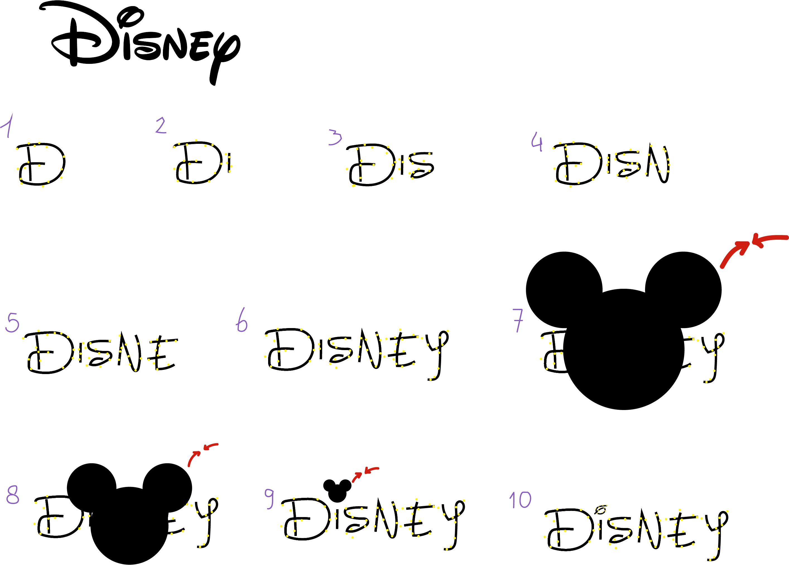

# Procesverslag
**Auteur:** Dana Tehubijuluw

**De opdrachten:** [opdracht 1](opdracht1/index.html) en [opdracht 2](opdracht2/index.html)

Markdown is een simpele manier om HTML te schrijven.  
Markdown cheat cheet: [Hulp bij het schrijven van Markdown](https://github.com/adam-p/markdown-here/wiki/Markdown-Cheatsheet).

Nb. De standaardstructuur en de spartaanse opmaak van de README.md zijn helemaal prima. Het gaat om de inhoud van je procesverslag. Besteedt de tijd voor pracht en praal aan je website.

Nb. Door *open* toe te voegen aan een *details* element kun je deze standaard open zetten. Fijn om dat steeds voor de relevante stuk(ken) te doen.

## Bronnenlijst
  1. -bron 1-
  2. -bron 2-
  3. -...-

## Opdracht 1 plan

  
Ik wil het logo van Disney gaan animeren. Ik heb een idee om het logo per letter te laten verschijnen en als het lukt met een soort sparkle over de letters. Als het logo tekstueel compleet is, verschijnt er een element die Mickey Mouse voorstelt. Dit element wordt met een animatie verkleind richting het puntje van de i. Wanneer het element ongeveer op dezelfde grootte als het puntje van de i is, zal deze transformeren naar het oorspronkelijke puntje van de i van het font. 

  ### Je storyboard:
  

  ### Je ambitie: 
  Aan deze technieken/punten wil ik werken:
  - Animeren
 

## Opdracht 1 reflectie

  
uitwerken bij afronden opdracht (voor week 3)

  ### Je uitkomst - karakteristiek screenshot(s):
  <!--  -->

  ### Dit ging goed/Heb ik geleerd: 
  Ik ben helaas wegens mijn gezondheid weinig aanwezig geweest bij de lessen. Dit vind ik jammer, want ik vind het een heel leuk vak. In de les dat ik er was, ben ik begonnen met mijn logo animatie. Ik heb deze les best veel gedaan! Ik heb het font gevonden, gedownload en geimporteerd. Ik moest even nadenken hoe het ookalweer werkte met fontface en dergelijke, maar uiteindelijk is het vrij snel gelukt. Vervolgens ben ik begonnen met de letters 1 voor 1 laten verschijnen. Daarna heb ik er een gouden gradient overheen gedaan en die een soortvan laten loopen. Dit lijkt nu op een shimmer die over het logo heen gaat, ik ben blij met het resultaat!

  

  ### Dit was lastig/Is niet gelukt:
  Ik zou graag nog het puntje van de i willen laten veranderen in een mickey mouse silhouette, alleen weet ik nog niet zo goed hoe ik dit moet aanpakken. 

  <!--  -->

## Opdracht 2 plan

  
uitwerken na schetsen idee (voor week 4)

  ### Je ontwerp:
  

  ### Je ambitie: 
  Aan deze technieken/punten wil ik werken:
  - punt 1
  - punt 2
  - nog een punt
  - ...

## Opdracht 2 test

  
uitwerken na testen (week 6/7)

  Neem minimaal 5 bevindingen op:

  ### Bevinding 1:
  Omschrijving van wat er nog niet orde was (tekst en afbeeding(en)).

  #### oplossing:
  Beschrijving hoe je het hebt hebt opgelost of als het niet gelukt is hoe je het zou oplossen (tekst en afbeeding(en)).

  ### Bevinding 2:
  Omschrijving van wat er nog niet orde was (tekst en afbeeding(en)).

  #### oplossing:
  Beschrijving hoe je het hebt hebt opgelost of als het niet gelukt is hoe je het zou oplossen (tekst en afbeeding(en)).

  ### Bevinding 3:
  ...

## Opdracht 2 reflectie

  
uitwerken bij afronden opdracht (voor week 8)

  ### Je uitkomst - karakteristiek screenshot(s):
  

  ### Dit ging goed/Heb ik geleerd: 
  Korte omschrijving met plaatje(s)

  

  ### Dit was lastig/Is niet gelukt:
  Korte omschrijving met plaatje(s)

  

