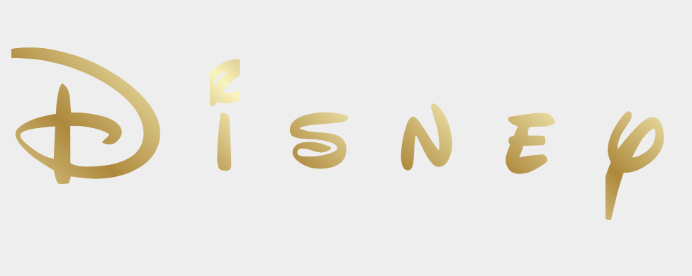
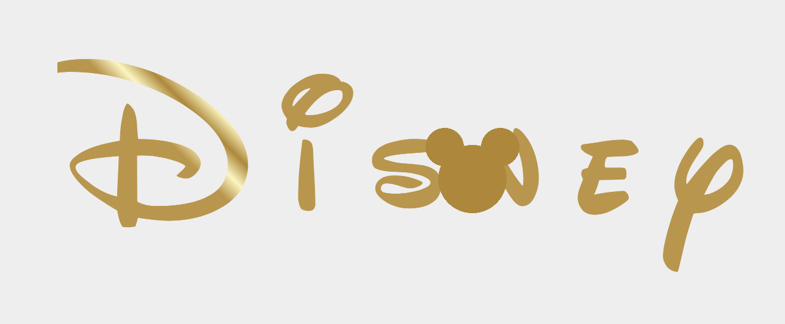
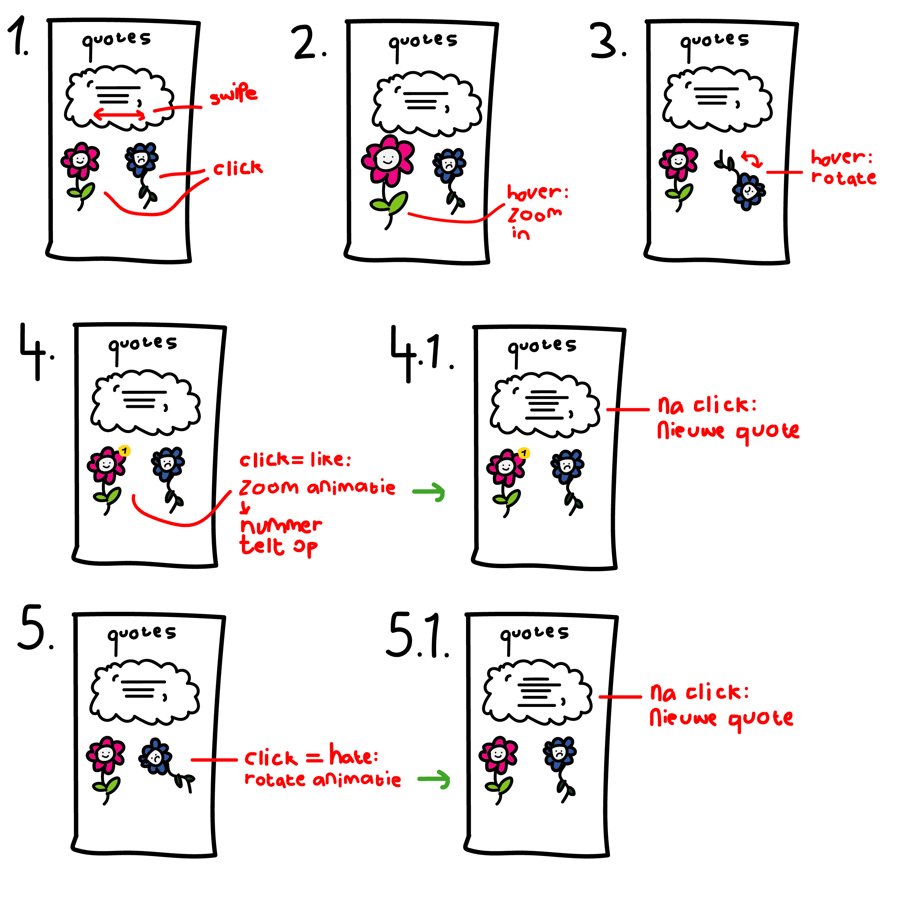
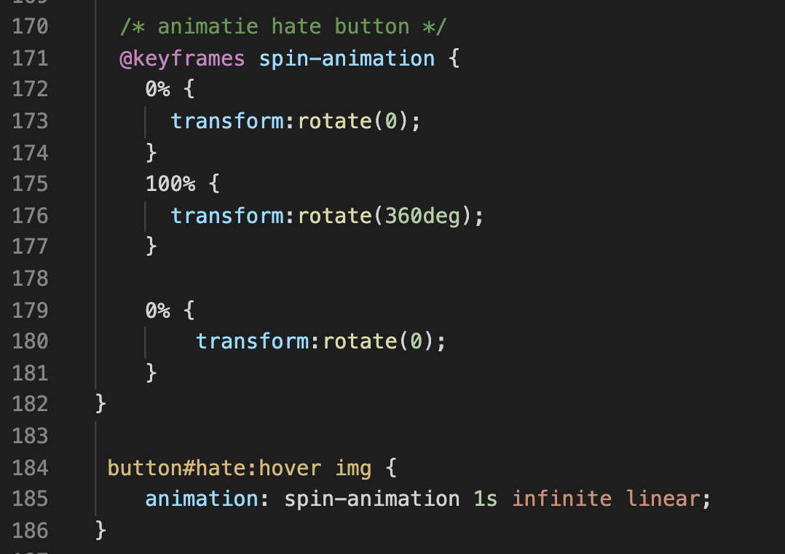
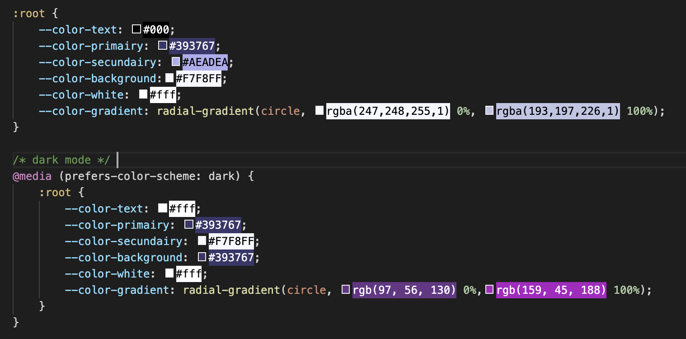
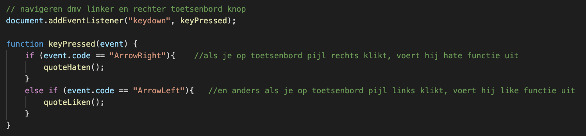
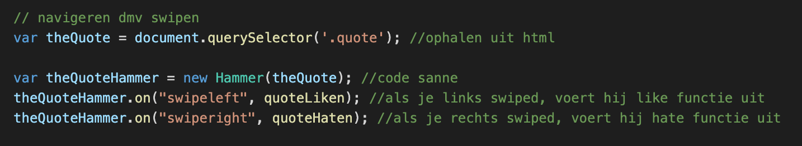
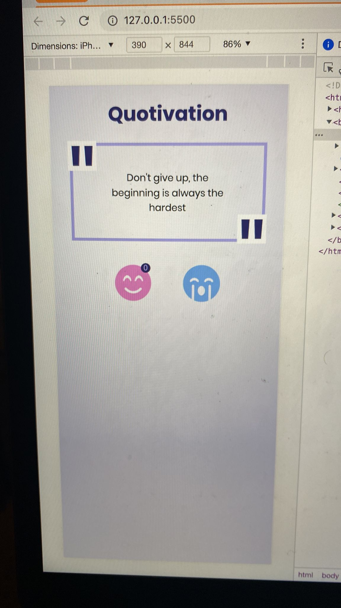
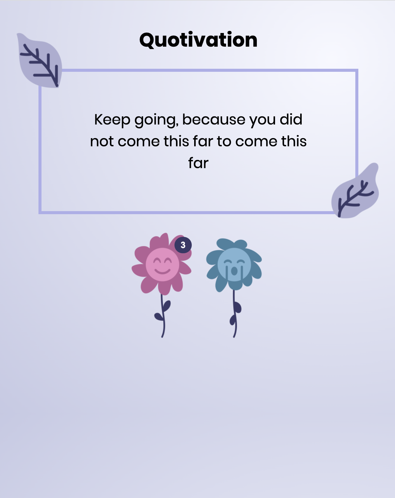

# Procesverslag
**Auteur:** Dana Tehubijuluw

**De opdrachten:** [opdracht 1](opdracht1/index.html) en [opdracht 2](opdracht2/index.html)

Markdown is een simpele manier om HTML te schrijven.  
Markdown cheat cheet: [Hulp bij het schrijven van Markdown](https://github.com/adam-p/markdown-here/wiki/Markdown-Cheatsheet).

Nb. De standaardstructuur en de spartaanse opmaak van de README.md zijn helemaal prima. Het gaat om de inhoud van je procesverslag. Besteedt de tijd voor pracht en praal aan je website.

Nb. Door *open* toe te voegen aan een *details* element kun je deze standaard open zetten. Fijn om dat steeds voor de relevante stuk(ken) te doen.

## Bronnenlijst
  1. https://codepen.io/shooft/pen/WNXRROo?editors=1100 
  2. https://www.geeksforgeeks.org/how-to-create-fade-in-effect-on-page-load-using-css/
  3. https://codepen.io/shooft/pen/WNXRROo?editors=1100

## Opdracht 1 plan

  
Ik wil het logo van Disney gaan animeren. Ik heb een idee om het logo per letter te laten verschijnen en als het lukt met een soort sparkle over de letters. Als het logo tekstueel compleet is, verschijnt er een element die Mickey Mouse voorstelt. Dit element wordt met een animatie verkleind richting het puntje van de i. Wanneer het element ongeveer op dezelfde grootte als het puntje van de i is, zal deze transformeren naar het oorspronkelijke puntje van de i van het font. 

  ### Je storyboard:
  

  ### Je ambitie: 
  Aan deze technieken/punten wil ik werken:
  - Animeren
 

## Opdracht 1 reflectie

  
uitwerken bij afronden opdracht (voor week 3)

  ### Je uitkomst - karakteristiek screenshot(s):

  ### Dit ging goed/Heb ik geleerd: 
  Ik ben helaas wegens mijn gezondheid weinig aanwezig geweest bij de lessen. Dit vind ik jammer, want ik vind het een heel leuk vak. In de les dat ik er was, ben ik begonnen met mijn logo animatie. Ik heb deze les best veel gedaan! Ik heb het font gevonden, gedownload en geimporteerd. Ik moest even nadenken hoe het ookalweer werkte met fontface en dergelijke, maar uiteindelijk is het vrij snel gelukt. Vervolgens ben ik begonnen met de letters 1 voor 1 laten verschijnen. Daarna heb ik er een gouden gradient overheen gedaan en die een soortvan laten loopen. Dit lijkt nu op een shimmer die over het logo heen gaat, ik ben blij met het resultaat!

  

  ### Dit was lastig/Is niet gelukt:
  Ik zou graag nog het puntje van de i willen laten veranderen in een mickey mouse silhouette. De mickey mouse heb ik gemaakt en de animatie zit er op. Het enige wat nog niet lukt is dat hij voordat de animatie begint niet in beeld moet staan. Daarnaast verspringt hij ook van positie zodra de animatie begint en dat is niet de bedoeling.

  

  Note: na even te zitten met Sanne is dit ook gelukt, woehoe! 

## Opdracht 2 plan

  
uitwerken na schetsen idee (voor week 4)

Voor opdracht 2 wil ik een soort quote generator maken waarbij je motiverende quotes te zien krijgt. Als je de quote leuk vindt en hij motiveert je, kun je de quote 'liken'. Wanneer de quote je niet genoeg motiveert, kun je de quote 'disliken'. In beide gevallen zul je een nieuwe quote krijgen.

  ### Je ontwerp:
  

  ### Je ambitie: 
  Aan deze technieken/punten wil ik werken:
  - ik wil weer oefenen met animeren
  - javascript beter onder de knie krijgen

## Opdracht 2 test

  
uitwerken na testen (week 6/7)

  Neem minimaal 5 bevindingen op:
  - hoveren
  - dark mode
  - navigeren met toetsenbord
  - navigeren met slepen

  ### Bevinding 1: hover werkt niet
  Ik wilde mijn design zo maken dat als je hovert over de buttons, een animatie afspeelt. Ik begreep maar niet waarom het hoveren niet werkte, ik dacht toch echt de code goed te hebben.

  #### oplossing:
 Uiteindelijk kwam ik er achter dat ik in de mobile inspector modus zat, hier werkt de hover niet want met een mobiel kun je natuurlijk ook niet hoveren. Een klein stom foutje dus! Na in een andere modus te zijn gegaan werkte de hover gelukkig gewoon goed. 

 

  ### Bevinding 2: dark mode instellen
  Wanneer mijn site een beetje goed werkte, moest ik nog de dark modus instellen. Ik vind het altijd lastig om na te denken welke kleur veranderd in welke kleur. Wanneer ik er echt even niet meer uit komt test ik het gewoon uit en pas ik aan de hand daarvan de kleuren aan.

  #### oplossing:
  Om ervoor te zorgen dat de dark modus werkte, heb ik een @media prefers-color-scheme aangemaakt. Hierbij heb ik dus de lichtere kleuren omgezet naar donkere kleuren en andersom hetzelfde. Tegenwoordig gebruiken veel mensen dark modus, dus het is heel goed om dit bij je website toe te passen. Zo kan iedere gebruiker optimaal genieten van je site.

 

  ### Bevinding 3: navigeren met toetsenbord
  Een van de eisen is dat de gebruiker zowel met muis/touch kan navigeren als met toetsenbord. Gelukkig hebben we dit vrijwel aan het begin van opdracht 2 met Sanne in de les geoefend, hierdoor wist ik al wat beter hoe ik moest beginnen. 

   #### oplossing:
   Een deel van de code kon ik hergebruiken. Ik moest in javascript werken met if en if else. ALS de rechterpijl toets is ingedrukt, voert hij de quoteHaten functie uit. EN ANDERS kun je met de linkerpijl toets ervoor zorgen dat hij de quoteLiken functie uitvoert. Op deze manier kun je gemakkelijk navigeren met je toetsen!
  
 

  ### Bevinding 4: navigeren met slepen
  Ook is een van de eisen dat de gebruiker met touch kan navigeren, bijvoorbeeld met slepen. Ik vond dit wat lastiger, ik had het zelf nog nooit gedaan. Door mee te kijken met de uitleg en andere studenten, heb ik uiteindelijk de code voor elkaar gekregen.

   #### oplossing:
   Navigeren met slepen doe je met javascript met 'Hammer'. Ik heb hier zelf nog nooit eerder van gehoord, maar het implementeren ging vrij soepel. Ik moest twee dingen ophalen uit de html: de quotes en Hammer. Vervolgens moest ik aangeven wat er moet gebeuren als je links veegt en als je rechts veegt.
  
 

 Uiteindelijk ben ik deze week aardig vooruit gegaan. Hieronder is mijn eerste versie van mijn site te zien!

  

## Opdracht 2 reflectie

  
uitwerken bij afronden opdracht (voor week 8)

  ### Je uitkomst - karakteristiek screenshot(s):
  Na de eerste versie heb ik zeker nog dingen aangepast. Ik vond het toch nog wat statisch en saai, het moest naar mijn mening iets levendiger. Daarom heb ik er uiteindelijk voor gekozen om met bloemen en bladeren te werken, zo krijgt het iets meer warmte en karakter! 
  
  

  ### Dit ging goed/Heb ik geleerd: 
  Ik vond het een uitdaging, maar wel weer heel leuk. Ik moet altijd even zoeken hoe ik het beste kan beginnen, maar eenmaal begonnen, ga ik graag met hoog tempo door. Ik vind het tof dat ik iets meer (simpele) javascript heb geleerd. Zo weet ik nu hoe je met javascript kunt navigeren met slepen, maar ook met je pijltjes toetsen. Ook heb ik code toegepast die ik al eerder gedaan heb, dit was weer een goed moment om mijn geheugen daarin op te frissen. Ik ben blij met het eindresultaat!

  ### Dit was lastig/Is niet gelukt:
  Wat ik vaak moeilijk vind is om in het begin de styling nog even weg te laten. Ik ben gek op ontwerpen, waardoor ik hier te vaak te vroeg mee begin. Het resulteert tot te veel tijd besteden aan het mooi maken van een pagina in plaats van alle benodigde content eerst te implementeren. Het is weer een leer les om hier op te letten en de css in het begin even links te laten liggen. Qua functies is alles wel gelukt wat ik wilde, dus dat is natuurlijk heel fijn!

